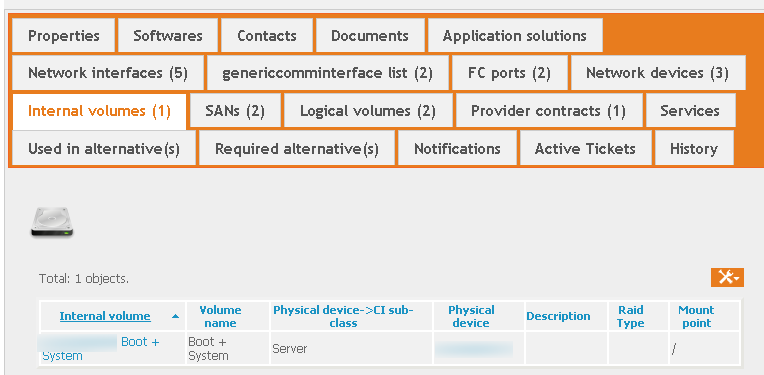
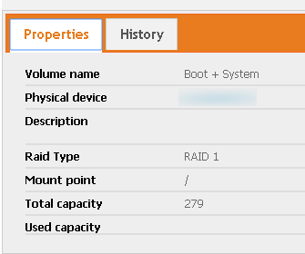

# iTop-internal-disk
This extension adds the ability to store the internal disk configuration of a server

# Goal
Logical Volumes in a server are volumes from an external disk array. I didn't see a way of showing the internal disks (that we use mostly for boot and OS installation).

This extension adds a new Tab for Servers, 'Internal volumes'. In this tab, you can describe your internal disk configuration.

The internal Disk Tab :

And the information for each internal disks

# Installation
As for all my extensions, just download the zip file, and copy the 'schirrms-...' directory in your extensions directory, then rerun the setup as usual.
